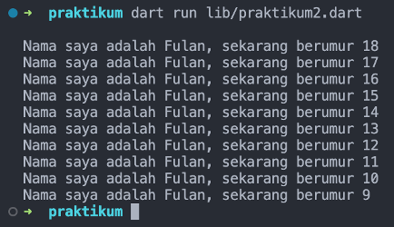

# Pemrograman Mobile - Pertemuan 2

<table>
    <thead>
        <th style="text-align: center;" colspan="2">Pertemuan 2</th>
    </thead>
    <tbody>
        <tr>
            <td>Nama</td>
            <td>Abid Gymnastiar Alfiansyah</td>
        </tr>
        <tr>
            <td>Nim</td>
            <td>2241720043</td>
        </tr>
        <tr>
            <td>Kelas</td>
            <td>3G</td>
        </tr>
    </tbody>
</table>

# Soal 1
Modifikasi kode pada baris 3

Output :

# Soal 2
Memahami Dart penting karena itu adalah bahasa utama atau Bahasa dasar di Flutter. Penguasaan Dart bisa membantu menulis kode lebih efisien, memahami cara kerja Flutter, dan memanfaatkan fitur-fitur pentingnya untuk membangun aplikasi yang berkinerja baik.

# Soal 3 (Rangkuman)

1. Getting Started With Dart
Dart adalah bahasa pemrograman modern yang menggabungkan kelebihan bahasa tingkat tinggi dengan fitur-fitur canggih, seperti:
	Productive tooling : Fitur alat untuk analisis kode, plugin IDE, dan ekosistem paket yang besar.
	Garbage collection: Mengelola memori dengan otomatis.
	Type annotations (opsional): Menjaga keamanan dan konsistensi data.
	Statically typed : Dart aman dengan type-safe dan type inference untuk mencegah bug saat kompilasi.
	Portability : Dart dapat diterjemahkan ke JavaScript atau dikompilasi secara native ke ARM dan x86.
Pemahaman mendalam tentang Dart penting dalam pengembangan Flutter, karena semua aspek seperti kode aplikasi, plugin, dan manajemen dependensi menggunakan Dart. Memahami dasar-dasar Dart meningkatkan produktivitas dan kenyamanan dalam bekerja dengan Flutter.
-	The Evolution of Dart
	Fokus awal pada pengembangan web dengan tujuan menggantikan JavaScript, namun kini beralih fokus ke pengembangan mobile, termasuk framework Flutter.
	Memperbaiki kekurangan JavaScript: Dart menawarkan ketahanan dan performa lebih baik dibandingkan JavaScript.
	Performa dan alat terbaik untuk proyek berskala besar, dengan dukungan plugin IDE dan bahasa yang tetap dinamis.
	Kuat dan fleksibel: Dart mempertahankan type annotations opsional dan fitur OOP, menyeimbangkan fleksibilitas dan ketangguhan.
	Bahasa modern lintas platform: Dart terus meningkatkan fitur-fiturnya, menjadikannya pilihan utama untuk Flutter.
-	How Dart to work
Fleksibilitas Dart berasal dari dua cara eksekusi kode:
1.	Dart Virtual Machines (VMs).
2.	JavaScript Compilations.
Kode Dart dapat dijalankan di lingkungan yang mendukung bahasa Dart, dengan memperhatikan komponen seperti runtime systems, core libraries, dan garbage collectors. Eksekusi kode Dart bisa dilakukan dalam dua mode:
•	Kompilasi Just-In-Time (JIT) : Kode sumber dikompilasi saat dibutuhkan, memungkinkan fitur seperti debugging dan hot reload, terutama digunakan selama pengembangan.
•	Kompilasi Ahead-Of-Time (AOT) : Kode dikompilasi sebelumnya untuk performa tinggi, tetapi tidak mendukung fitur seperti debugging dan hot reload.
-	Introducing the structure of the Dart language
Dart adalah bahasa OOP yang mendukung prinsip-prinsip seperti encapsulation, inheritance, dan polymorphism. Objek menyimpan data dan kode, dibuat dari class sebagai cetak biru. Jika Anda sudah familiar dengan OOP di bahasa lain seperti Java, konsep OOP di Dart akan sangat mirip.
•	Dart operator 
menggunakan method pada x. Untuk semua tipe data, tidak seperti bahasa Java yang memiliki data primitif, x selalu berupa turunan dari kelas yang memiliki method. Ini berarti bahwa operator dapat diganti sesuai logika yang Anda inginkan.
•	Aritmatika Operators
-	`+` untuk tambahan
-	`-` untuk pengurangan
-	`*` untuk perkalian
-	`/` untuk pembagian 
-	`-/` untuk pembagian bilangan bulat
-	`%` untuk operasi modulus
-	`-expression` untuk negasi (yang membalikkan suatu nilai)
-	Dart juka menyediakan shortcut operator untuk menggabungkan variable setelah operasi lainnya  dengan menambah `=`
•	Increment & Decrement operator
o	++var atau var++ untuk menambah  nilai variable var sebesar 1
o	--var atau var—untuk mengurangi nilai variable var sebesar 1
•	Equality & Decrement operator
o	Persamaan operator
	== untuk memberikan apaakah operan sama 
	!= untuk memeriksa apakah operan berbeda
o	Untuk melakukan pengujian rasional
	> apakah operan kiri lebih besar dari operan kanan
	< apakah operan kiri lebih kecil dari operan kanan
	>= memeriksa apakah operasi kiri lebih besar atau sama dengan operasi kanan
	<= memeriksa apakah operasi kiri lebih kecil atau sama dengan operasi kanan
•	Logical Operator
o	!expression negasi atau kebalikan dari hasil expressi – yaitu true menjadi false dan false menjadi true
o	|| menerapkan operasi logika OR antara dua expresi
o	&& menerapkan operasi logika AND antara dua expresi
-	Hands-on with Dart
Dart menggunakan function dan method untuk memisahkan kode. Function adalah potongan kode yang menerima data, mengeksekusinya, dan mengembalikan hasil. Function `main` adalah entry point yang dicari oleh Dart VM untuk memulai eksekusi. Function `main` biasanya tidak mengembalikan data (void) dan tidak menerima parameter.
Perbedaan antara function dan method adalah bahwa function berada di luar class, sedangkan method terikat pada class dan memiliki akses ke instance class melalui keyword `this`. Function `main` adalah contoh function, bukan method.

# Soal 4
[Link Google Slide](https://docs.google.com/presentation/d/1hNlgt5Z8poUFuVDshPuh-j6CIzDtJiQ5S67-QvIeH2U/edit?usp=sharing)