# Pemrograman Mobile - Pertemuan 3

<table>
    <thead>
        <th style="text-align: center;" colspan="2">Pertemuan 2</th>
    </thead>
    <tbody>
        <tr>
            <td>Nama</td>
            <td>Abid Gymnastiar Alfiansyah</td>
        </tr>
        <tr>
            <td>Nim</td>
            <td>2241720043</td>
        </tr>
        <tr>
            <td>Kelas</td>
            <td>3G</td>
        </tr>
    </tbody>
</table>

 
# Soal 1

<b>A. Praktikum 1 : Menerapkan Control Flows (“If/ Else”)</b>

1. Langkah 1

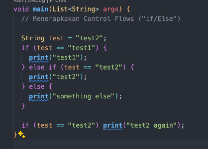

2. Langkah 2

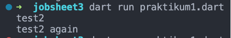

3. Langkah 3

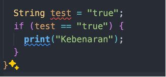

Output error

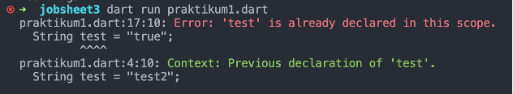

Kode tersebut mengalami error karena variable test dideklarasi 2 kali, pada dart tidak diizinkan mendeklarasikan nama variable yang sama. Berikut merupakan perbaikan nya

running

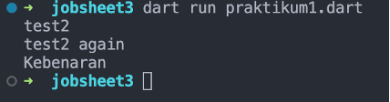

<b>B. Praktikum 2 : Menerapkan Perulangan “While” dan “do-while”</b>

1. Langkah 1

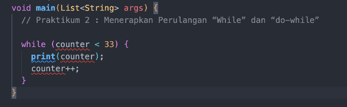

2. Langkah 2

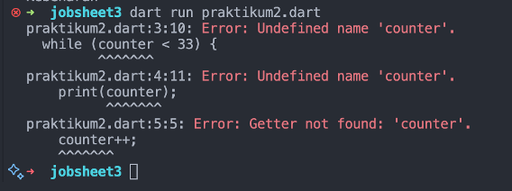

Error dikarenakan nama variable counter belum dideklarasi dan di inisialisasi 
diperbaiki

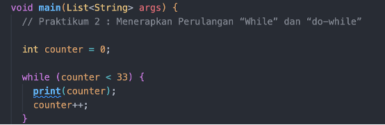

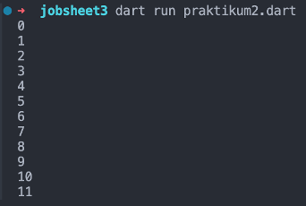

3. Langkah 3

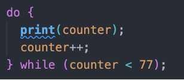

Hasil : tidak terjadi error dikarenakan var counter sudah di deklarasi dan di inisialisasi di praktikum sebelumnya 

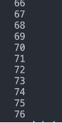

<b>C. Praktikum 3 : Menerapkan Control Flows (“If/ Else”)</b>

1. Langkah 1

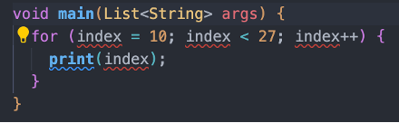

2. Langkah 2

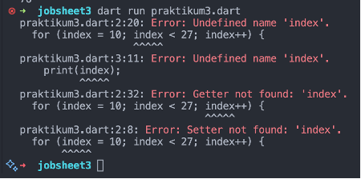

Error dikarenakan var index belum dideklarasikan sebelum digunakan

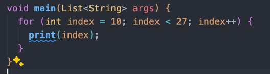

Hasil Ketika sudah diperbaiki

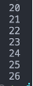

3. Langkah 3

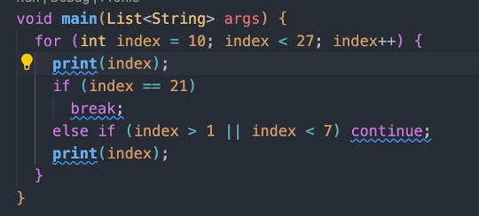

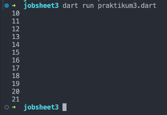

Tidak terjadi error, akan tetapi akan berbeda dengan pada Langkah ke-2. Biarpun for di set kurang dari 27 tetapi dalam kondisi if didalamnya di set index == 21. Maka pada saat kondisi for ngeloop sampai ketemu 21 maka akan berhenti atau break;

<b>D. Praktikum 4 : Menerapkan Control Flows (“If/ Else”)</b>