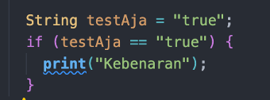

# Pemrograman Mobile - Pertemuan 3

<table>
    <thead>
        <th style="text-align: center;" colspan="2">Pertemuan 2</th>
    </thead>
    <tbody>
        <tr>
            <td>Nama</td>
            <td>Abid Gymnastiar Alfiansyah</td>
        </tr>
        <tr>
            <td>Nim</td>
            <td>2241720043</td>
        </tr>
        <tr>
            <td>Kelas</td>
            <td>3G</td>
        </tr>
    </tbody>
</table>

 
# Soal 1

<b>A. Praktikum 1 : Menerapkan Control Flows (“If/ Else”)</b>

1. Langkah 1

2. Langkah 2

3. Langkah 3

Output error

Kode tersebut mengalami error karena variable test dideklarasi 2 kali, pada dart tidak diizinkan mendeklarasikan nama variable yang sama. Berikut merupakan perbaikan nya

running

<b>B. Praktikum 2 : Menerapkan Control Flows (“If/ Else”)</b>

<b>C. Praktikum 3 : Menerapkan Control Flows (“If/ Else”)</b>

<b>D. Praktikum 4 : Menerapkan Control Flows (“If/ Else”)</b>