# Pemrograman Mobile - Pertemuan 3

<table>
    <thead>
        <th style="text-align: center;" colspan="2">Pertemuan 2</th>
    </thead>
    <tbody>
        <tr>
            <td>Nama</td>
            <td>Abid Gymnastiar Alfiansyah</td>
        </tr>
        <tr>
            <td>Nim</td>
            <td>2241720043</td>
        </tr>
        <tr>
            <td>Kelas</td>
            <td>3G</td>
        </tr>
    </tbody>
</table>

# Soal 1

<b>A. Praktikum 1 : Eksperimen tipe data list</b>

1. Langkah 1

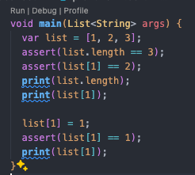

2. Langkah 2

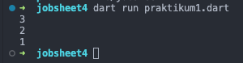

Mendefinisikan sebuah list berisi angka [1, 2, 3], lalu menggunakan assert untuk memverifikasi beberapa kondisi:

- assert(list.length == 3): Memastikan panjang list adalah 3.
- assert(list[1] == 2): Memastikan elemen pada indeks ke-1 adalah 2.
- Mencetak panjang list dan elemen di indeks ke-1.
- Mengubah nilai elemen pada indeks ke-1 dari 2 menjadi 1.
- assert(list[1] == 1): Memastikan perubahan berhasil, yaitu elemen pada indeks ke-1 menjadi 1.
- Mencetak elemen yang telah diubah di indeks ke-1.

3. Langkah 3

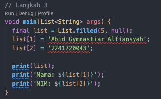

Output error

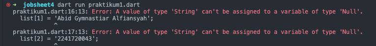

Error tersebut terjadi karena Dart mendeteksi tipe data dari List.filled(5, null) sebagai list dengan elemen bertipe Null, sehingga Anda tidak bisa memasukkan tipe data lain seperti String dan int. Solusi untuk masalah ini adalah mendeklarasikan list dengan tipe dynamic, yang memungkinkan penyimpanan berbagai tipe data di dalam list.

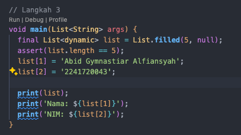

List<dynamic>: Menggunakan List<dynamic> memungkinkan list untuk menyimpan elemen dari berbagai tipe data seperti String dan int.
running

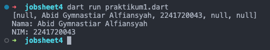

<b>B. Praktikum 2 : eksperimen tipe data set</b>

1. Langkah 1

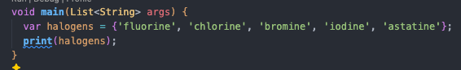

2. Langkah 2

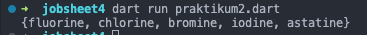

kode tersebut mendefinisikan sebuah set Bernama halogens yang berisi elemen string 

3. Langkah 3

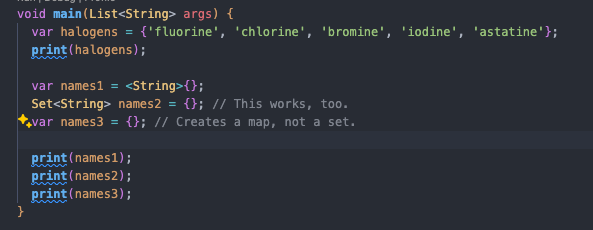

Hasil : Tidak terjadi error tetapi hanya mencetak index kosong 

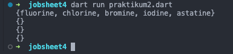

Setelah diinputkan datanya 

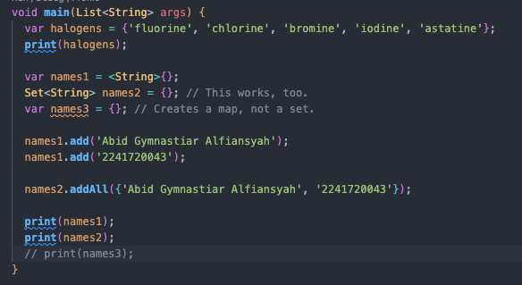

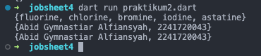

<b>C. Praktikum 3 : Eksperimen tipe data maps</b>

1. Langkah 1

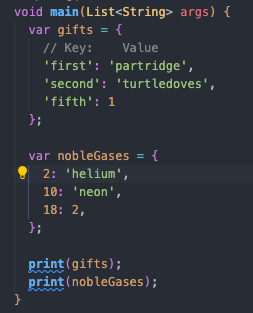

2. Langkah 2

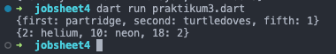

Tidak ada error karena Dart tidak membatasi tipe data pada elemen dalam Map, selama tipe kunci konsisten di dalam satu Map.

3. Langkah 3

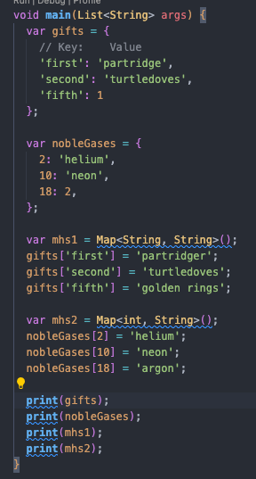

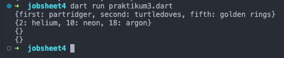

Tidak terjadi error karena mhs1 dan mhs2 menginisialisasi dua Map kosong tetapi tidak digunakan lebih lanjut karena tidak ada data yang dimasukkan ke dalamnya. Dan memodifikasi Map lain, yaitu gifts dan nobleGases, dengan menambahkan atau mengganti nilai pada kunci yang ada.

<b>Modifikasi</b>

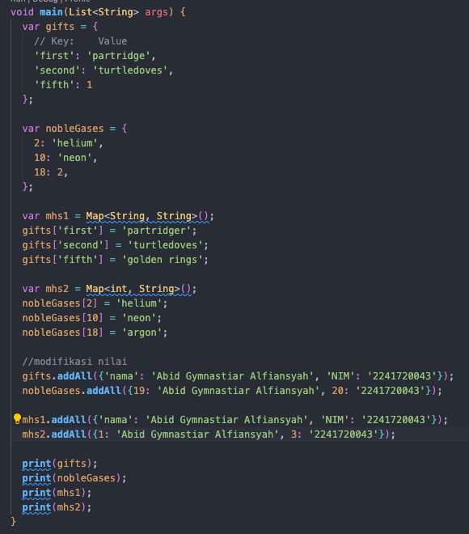

output run

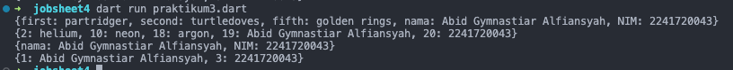

<b>D. Praktikum 4 : Eksperimen Tipe data list, Spread dan control-flow operators</b>

1. Langkah 1

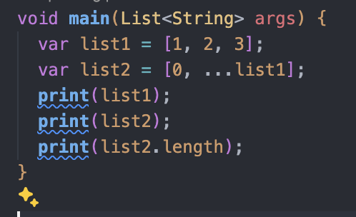

2. Langkah 2

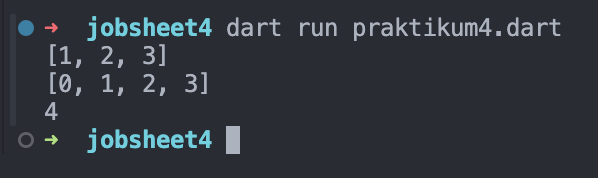

Kode di atas membuat dua list, `list1’ dengan elemen `[1, 2, 3]` dan `list2` yang berisi elemen ‘0’ diikuti dengan semua elemen dari `list1` menggunakan ‘spread operator (`...`)’, sehingga `list2` menjadi `[0, 1, 2, 3]`. Kode kemudian mencetak `list1`, `list2`, dan panjang dari ‘list2` yang hasilnya adalah ‘4’. Spread operator memungkinkan elemen dari satu list untuk disalin ke list lain.

3. Langkah 3

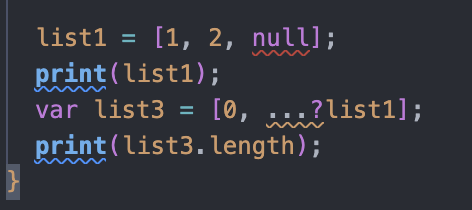

hasil 

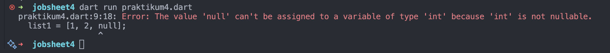

Error terjadi pada bagian `list1 = [1, 2, null];` karena dalam Dart, list yang dideklarasikan dengan tipe `List<int>` tidak dapat berisi nilai `null`. Pada kode ini, Dart mengasumsikan bahwa `list1` adalah `List<int>`, sehingga ketika kita mencoba menambahkan `null`, itu menyebabkan error karena `null` bukan tipe `int`. Untuk mengatasi masalah ini, tipe list harus diubah menjadi `List<int?>` agar bisa menampung nilai `null`.

Perbaikan 

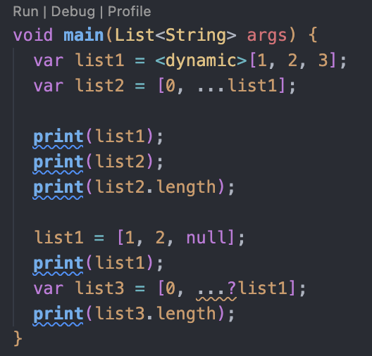

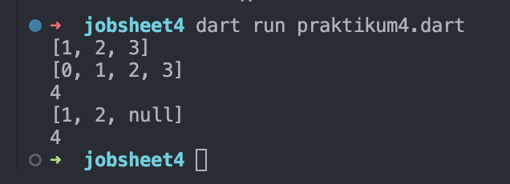

4. Langkah 4

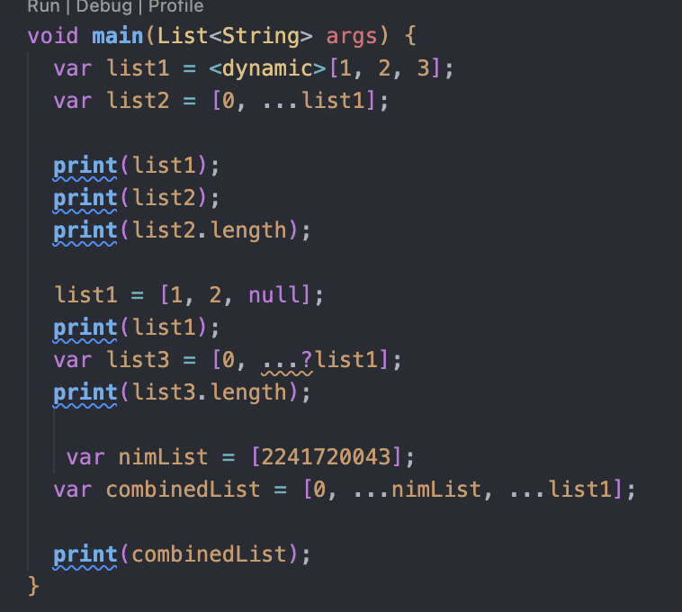

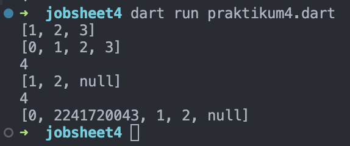

Error tersebut terjadi karena variabel promoActive belum didefinisikan, sehingga Dart tidak dapat menemukan variabel tersebut dalam konteks program.

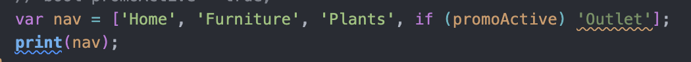

Jika promoActive bernilai true, item 'Outlet' akan ditambahkan ke list nav. Jika false, item tersebut tidak akan ditambahkan.

5. Langkah 5

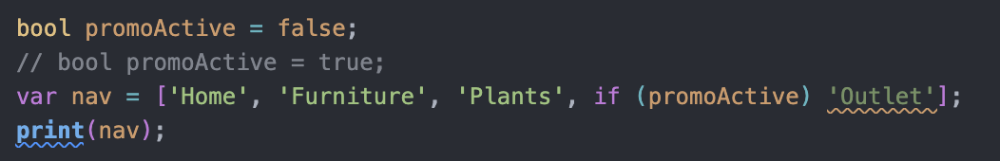

running

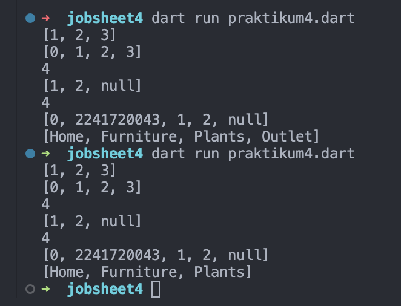

Error pada kode ini disebabkan oleh penggunaan sintaks yang tidak valid: if (login case 'Manager'). Dart tidak mendukung sintaks seperti itu untuk perbandingan langsung dalam kondisi if.

<b>Perbaiki</b>

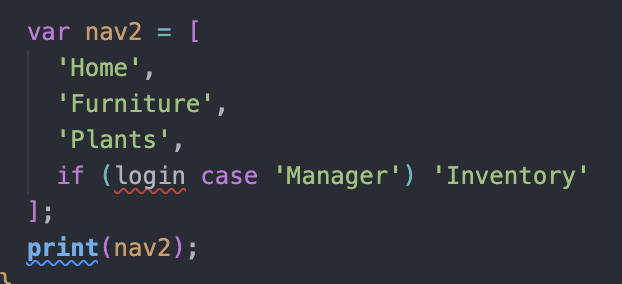

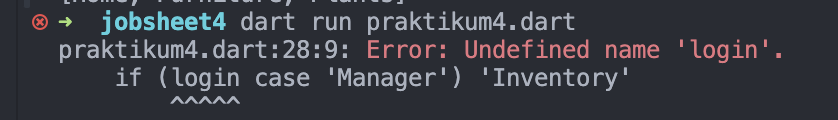

Penyelesaian dengan instansiasi var login dengan tipe data string 

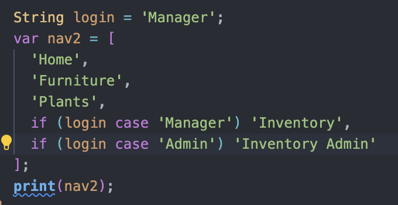

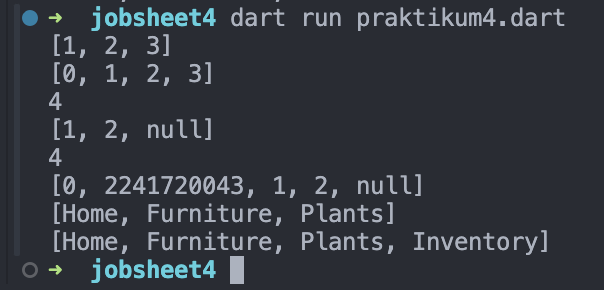

Menambahkan var login dengan menggunakan kondisi tertentu jika hasil nya tidak == var login maka tidak akan dicetak

6. Langkah 6

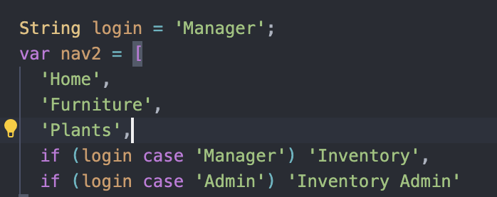

hasil

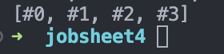

Kode tersebut menggunakan `for` di dalam list untuk menghasilkan `listOfStrings` dari `listOfInts`. `listOfInts` berisi `[1, 2, 3]`, dan `listOfStrings` menggabungkan elemen-elemen tersebut menjadi string dengan format `#i`, menghasilkan `['#0', '#1', '#2', '#3']`. Pernyataan `assert` memastikan bahwa elemen kedua adalah `'#1'`, dan hasil akhirnya mencetak `['#0', '#1', '#2', '#3']`.

Manfaat 

Dengan for dalam list, kita bisa dengan cepat mengubah list integer listOfInts menjadi list string listOfStrings secara dinamis, menghasilkan elemen seperti '#1', '#2', dll., tanpa menulis kode loop yang lebih panjang.

<b>D. Praktikum 5 : Tugas</b>
 

<b>D. Praktikum 5 : Tugas</b>
 
