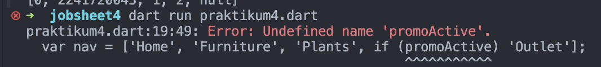
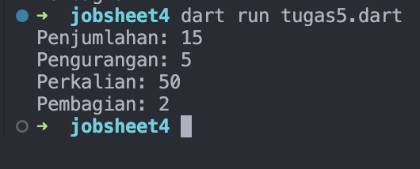

# Pemrograman Mobile - Pertemuan 3

<table>
    <thead>
        <th style="text-align: center;" colspan="2">Pertemuan 2</th>
    </thead>
    <tbody>
        <tr>
            <td>Nama</td>
            <td>Abid Gymnastiar Alfiansyah</td>
        </tr>
        <tr>
            <td>Nim</td>
            <td>2241720043</td>
        </tr>
        <tr>
            <td>Kelas</td>
            <td>3G</td>
        </tr>
    </tbody>
</table>

# Praktikum

<b>A. Praktikum 1 : Eksperimen tipe data list</b>

1. Langkah 1

2. Langkah 2

Mendefinisikan sebuah list berisi angka [1, 2, 3], lalu menggunakan assert untuk memverifikasi beberapa kondisi:

- assert(list.length == 3): Memastikan panjang list adalah 3.
- assert(list[1] == 2): Memastikan elemen pada indeks ke-1 adalah 2.
- Mencetak panjang list dan elemen di indeks ke-1.
- Mengubah nilai elemen pada indeks ke-1 dari 2 menjadi 1.
- assert(list[1] == 1): Memastikan perubahan berhasil, yaitu elemen pada indeks ke-1 menjadi 1.
- Mencetak elemen yang telah diubah di indeks ke-1.

3. Langkah 3

Output error

Error tersebut terjadi karena Dart mendeteksi tipe data dari List.filled(5, null) sebagai list dengan elemen bertipe Null, sehingga Anda tidak bisa memasukkan tipe data lain seperti String dan int. Solusi untuk masalah ini adalah mendeklarasikan list dengan tipe dynamic, yang memungkinkan penyimpanan berbagai tipe data di dalam list.

List<dynamic>: Menggunakan List<dynamic> memungkinkan list untuk menyimpan elemen dari berbagai tipe data seperti String dan int.
running

<b>B. Praktikum 2 : eksperimen tipe data set</b>

1. Langkah 1

2. Langkah 2

kode tersebut mendefinisikan sebuah set Bernama halogens yang berisi elemen string

3. Langkah 3

Hasil : Tidak terjadi error tetapi hanya mencetak index kosong

Setelah diinputkan datanya

<b>C. Praktikum 3 : Eksperimen tipe data maps</b>

1. Langkah 1

2. Langkah 2

Tidak ada error karena Dart tidak membatasi tipe data pada elemen dalam Map, selama tipe kunci konsisten di dalam satu Map.

3. Langkah 3

Tidak terjadi error karena mhs1 dan mhs2 menginisialisasi dua Map kosong tetapi tidak digunakan lebih lanjut karena tidak ada data yang dimasukkan ke dalamnya. Dan memodifikasi Map lain, yaitu gifts dan nobleGases, dengan menambahkan atau mengganti nilai pada kunci yang ada.

<b>Modifikasi</b>

output run

<b>D. Praktikum 4 : Eksperimen Tipe data list, Spread dan control-flow operators</b>

1. Langkah 1

2. Langkah 2

Kode di atas membuat dua list, `list1’ dengan elemen `[1, 2, 3]`dan`list2`yang berisi elemen ‘0’ diikuti dengan semua elemen dari`list1` menggunakan ‘spread operator (`...`)’, sehingga `list2`menjadi`[0, 1, 2, 3]`. Kode kemudian mencetak `list1`, `list2`, dan panjang dari ‘list2` yang hasilnya adalah ‘4’. Spread operator memungkinkan elemen dari satu list untuk disalin ke list lain.

3. Langkah 3

hasil

Error terjadi pada bagian `list1 = [1, 2, null];` karena dalam Dart, list yang dideklarasikan dengan tipe `List<int>` tidak dapat berisi nilai `null`. Pada kode ini, Dart mengasumsikan bahwa `list1` adalah `List<int>`, sehingga ketika kita mencoba menambahkan `null`, itu menyebabkan error karena `null` bukan tipe `int`. Untuk mengatasi masalah ini, tipe list harus diubah menjadi `List<int?>` agar bisa menampung nilai `null`.

Perbaikan

4. Langkah 4

Error tersebut terjadi karena variabel promoActive belum didefinisikan, sehingga Dart tidak dapat menemukan variabel tersebut dalam konteks program.

Jika promoActive bernilai true, item 'Outlet' akan ditambahkan ke list nav. Jika false, item tersebut tidak akan ditambahkan.

5. Langkah 5

running

Error pada kode ini disebabkan oleh penggunaan sintaks yang tidak valid: if (login case 'Manager'). Dart tidak mendukung sintaks seperti itu untuk perbandingan langsung dalam kondisi if.

<b>Perbaiki</b>

Penyelesaian dengan instansiasi var login dengan tipe data string

Menambahkan var login dengan menggunakan kondisi tertentu jika hasil nya tidak == var login maka tidak akan dicetak

6. Langkah 6

hasil

Kode tersebut menggunakan `for` di dalam list untuk menghasilkan `listOfStrings` dari `listOfInts`. `listOfInts` berisi `[1, 2, 3]`, dan `listOfStrings` menggabungkan elemen-elemen tersebut menjadi string dengan format `#i`, menghasilkan `['#0', '#1', '#2', '#3']`. Pernyataan `assert` memastikan bahwa elemen kedua adalah `'#1'`, dan hasil akhirnya mencetak `['#0', '#1', '#2', '#3']`.

Manfaat

Dengan for dalam list, kita bisa dengan cepat mengubah list integer listOfInts menjadi list string listOfStrings secara dinamis, menghasilkan elemen seperti '#1', '#2', dll., tanpa menulis kode loop yang lebih panjang.

<b>D. Praktikum 5 : Eksperimen tipe data record</b>
 

1. Langkah 1

2. Langkah 2

Kode Dart tersebut mendefinisikan sebuah **record** yang menyimpan beberapa nilai, baik posisional maupun bernama: `'first'`, `a: 2`, `b: true`, dan `'last'`. Kode kemudian mencetak isi record, yang hasilnya adalah `(first, a: 2, b: true, last)`. **Records** di Dart memungkinkan pengelompokan berbagai nilai tanpa perlu membuat class khusus.

3. Langkah 3

Fungsi `tukar` bertujuan untuk menukar dua nilai integer dalam sebuah record bertipe `(int, int)`. Fungsi ini menerima sebuah record dengan dua integer sebagai parameter, lalu memecahnya menjadi dua variabel `a` dan `b`. Setelah itu, fungsi mengembalikan record baru dengan posisi kedua nilai tersebut ditukar, sehingga hasilnya adalah `(b, a)`.

4. Langkah 4

Error tersebut terjadi karena variabel `mahasiswa` yang bertipe non-nullable (tidak bisa bernilai `null`) digunakan sebelum diberikan nilai. Di Dart, semua variabel non-nullable wajib diinisialisasi sebelum digunakan. Untuk memperbaikinya, pastikan variabel `mahasiswa` diinisialisasi dengan nilai awal (misalnya nilai default atau objek) sebelum digunakan dalam kode.

5. Langkah 5

Pada kode tersebut mengakses elemen dalam record menggunakan indexs posisional dan nama label.

# Tugas Praktikum

 

<b>Soal 1 : Jelaskan yang dimaksud Functions dalam bahasa Dart!</b>

jawab :
Dalam bahasa Dart, Functions (fungsi) adalah blok kode yang dapat digunakan kembali untuk menjalankan tugas atau perhitungan tertentu. Fungsi memungkinkan kita mengelompokkan kode ke dalam unit-unit yang lebih kecil, membuat program lebih modular dan mudah dipelihara. Fungsi dapat menerima masukan berupa parameter dan mengembalikan nilai setelah memproses masukan tersebut.

<b>Soal 2 : Jelaskan jenis-jenis parameter di Functions beserta contoh sintaksnya!</b>

jawab :

Dalam Dart, terdapat empat jenis parameter dalam fungsi:
- Positional Parameters: Parameter yang diurutkan saat pemanggilan fungsi.
- Optional Positional Parameters: Parameter opsional yang dibungkus dengan [].
- Named Parameters: Parameter yang diberi nama, dibungkus dengan {}. Bisa bersifat opsional atau menggunakan required untuk membuatnya wajib.
- Default Parameters: Parameter opsional yang memiliki nilai default.

contoh sintak:

runnning

<b>Soal 3 : Jelaskan maksud Functions sebagai first-class objects beserta contoh sintaknya!</b>

Jawab :

Dalam Dart, Functions sebagai first-class objects berarti bahwa fungsi diperlakukan sebagai objek, sehingga dapat:

- Disimpan dalam variabel.
- Dikirim sebagai argumen ke fungsi lain.
- Dikembalikan dari fungsi lain.
- Ini memungkinkan kita untuk menulis kode yang lebih fleksibel dan mendukung pemrograman fungsional.

runnning

Penjelasan:
- Fungsi anonim disimpan dalam variabel (salam): Fungsi dapat dipanggil seperti variabel lainnya.
- Fungsi sebagai argumen (salamCetak): Kita bisa mengirim fungsi sebagai parameter untuk dicetak.
- Fungsi yang mengembalikan fungsi lain (fungsiPembuatSalam): Fungsi ini membuat dan mengembalikan fungsi lain berdasarkan input.

<b>Soal 4 : Apa itu Anonymous Functions? Jelaskan dan berikan contohnya!</b>

Jawab :

Anonymous Functions (fungsi anonim) adalah fungsi yang tidak memiliki nama dan biasanya didefinisikan secara langsung di tempat di mana mereka digunakan. Fungsi ini sering digunakan untuk menyederhanakan kode, meningkatkan keterbacaan, dan membuatnya lebih ringkas, terutama ketika fungsi tersebut hanya diperlukan dalam konteks tertentu, seperti dalam callback atau operasi pada koleksi.

Contoh :

runnning

<b>Soal 5 : Jelaskan perbedaan Lexical scope dan Lexical closures! Berikan contohnya!</b>

Jawab:

Lexical Scope
Lexical Scope (ruang lingkup leksikal) merujuk pada cara variabel diakses dalam fungsi berdasarkan lokasi mereka dideklarasikan dalam kode. Variabel yang dideklarasikan dalam suatu blok atau fungsi hanya dapat diakses dari dalam blok tersebut dan anak bloknya.

runnning

Lexical Closures
Lexical Closures adalah fungsi yang "menangkap" variabel dari ruang lingkup leksikalnya. Artinya, fungsi ini dapat mengakses variabel yang dideklarasikan di luar fungsi tersebut, bahkan setelah ruang lingkup asalnya berakhir. Closure menyimpan referensi ke variabel yang ditangkap, sehingga tetap dapat diakses.

runnning

<b>Soal 6 : Jelaskan dengan contoh cara membuat return multiple value di Functions!</b>

Di Dart, kamu dapat mengembalikan beberapa nilai dari sebuah fungsi menggunakan beberapa cara, termasuk:

- Menggunakan List atau Map: Mengembalikan beberapa nilai dalam bentuk koleksi.
- Menggunakan Class atau Struct: Membuat kelas untuk mengelompokkan nilai-nilai yang ingin dikembalikan.
- Menggunakan Tuple: Meskipun Dart tidak memiliki tuple bawaan, kita bisa menggunakan paket eksternal untuk ini.

Berikut adalah contoh untuk masing-masing metode:
- Menggunakan List

runnning

- Menggunakan Map 

runnning

- Menggunakan Kelas

runnning

