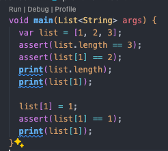

# Pemrograman Mobile - Pertemuan 5

<table>
    <thead>
        <th style="text-align: center;" colspan="2">Pertemuan 5</th>
    </thead>
    <tbody>
        <tr>
            <td>Nama</td>
            <td>Abid Gymnastiar Alfiansyah</td>
        </tr>
        <tr>
            <td>Nim</td>
            <td>2241720043</td>
        </tr>
        <tr>
            <td>Kelas</td>
            <td>3G</td>
        </tr>
    </tbody>
</table>

# Praktikum 1: Membuat Project Flutter Baru

# Praktikum 2: Menghubungkan Perangkat Android atau Emulator

# Praktikum 3: Membuat Repository GitHub dan Laporan Praktikum

# Praktikum 4: Menerapkan Widget Dasar

# Praktikum 5: Menerapkan Widget Material Design dan iOS Cupertino

