# Pemrograman Mobile - Pertemuan 7

<table>
    <thead>
        <th style="text-align: center;" colspan="2">Pertemuan 7</th>
    </thead>
    <tbody>
        <tr>
            <td>Nama</td>
            <td>Abid Gymnastiar Alfiansyah</td>
        </tr>
        <tr>
            <td>Nim</td>
            <td>2241720043</td>
        </tr>
        <tr>
            <td>Kelas</td>
            <td>3G</td>
        </tr>
    </tbody>
</table>

# Praktikum Menerapkan Plugin di Project Flutter

### Langkah 1: Buat Project Baru

    Buatlah sebuah project flutter baru dengan nama flutter_plugin_pubdev. Lalu jadikan repository di GitHub Anda dengan nama flutter_plugin_pubdev.

- hasil 

     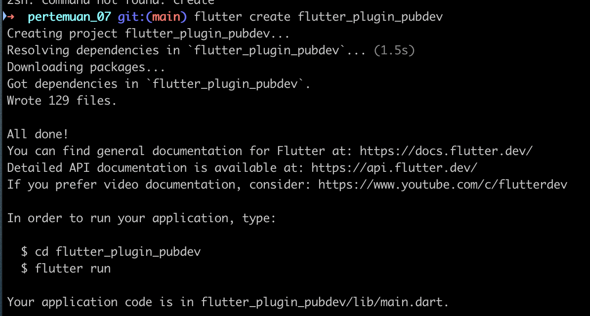

### Langkah 2: Menambahkan Plugin

    Tambahkan plugin auto_size_text menggunakan perintah berikut di terminal

     

- hasil 

     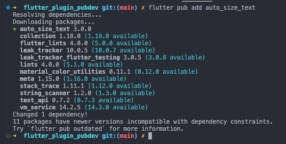

    Jika berhasil, maka akan tampil nama plugin beserta versinya di file pubspec.yaml pada bagian dependencies.
- hasil 

     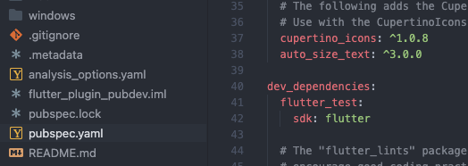

### Langkah 3: Buat file red_text_widget.dart

    Buat file baru bernama red_text_widget.dart di dalam folder lib lalu isi kode seperti berikut.

     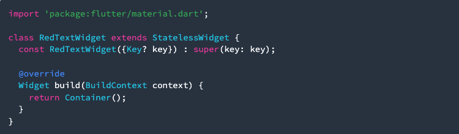

- Hasil 

     

### Langkah 4: Tambah Widget AutoSizeText

    Masih di file red_text_widget.dart, untuk menggunakan plugin auto_size_text, ubahlah kode return Container() menjadi seperti berikut.

     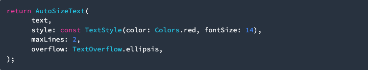

- Hasil 

     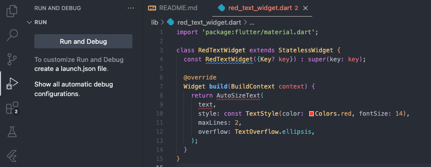

    Setelah Anda menambahkan kode di atas, Anda akan mendapatkan info error. Mengapa demikian? Jelaskan dalam laporan praktikum Anda!

- Hasil error

     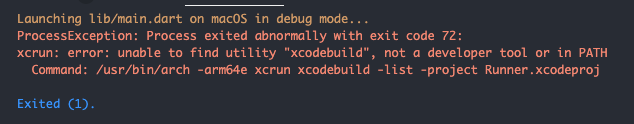

- Eror dikarenakan belum menambahkan dependency, jalankan perintah flutter pub get di terminal untuk mendownload package tersebut.

     

- Import package di file Dart: Setelah package terinstall, jangan lupa untuk mengimport auto_size_text di file Dart Anda.

     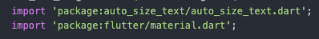

### Langkah 5: Buat Variabel text dan parameter di constructor

    Tambahkan variabel text dan parameter di constructor seperti berikut.

     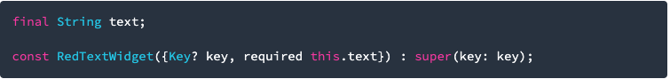

- Hasil

     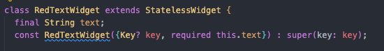

### Langkah 6: Tambahkan widget di main.dart

    Buka file main.dart lalu tambahkan di dalam children: pada class _MyHomePageState

     

- Sintak

     

- Hasil Run

     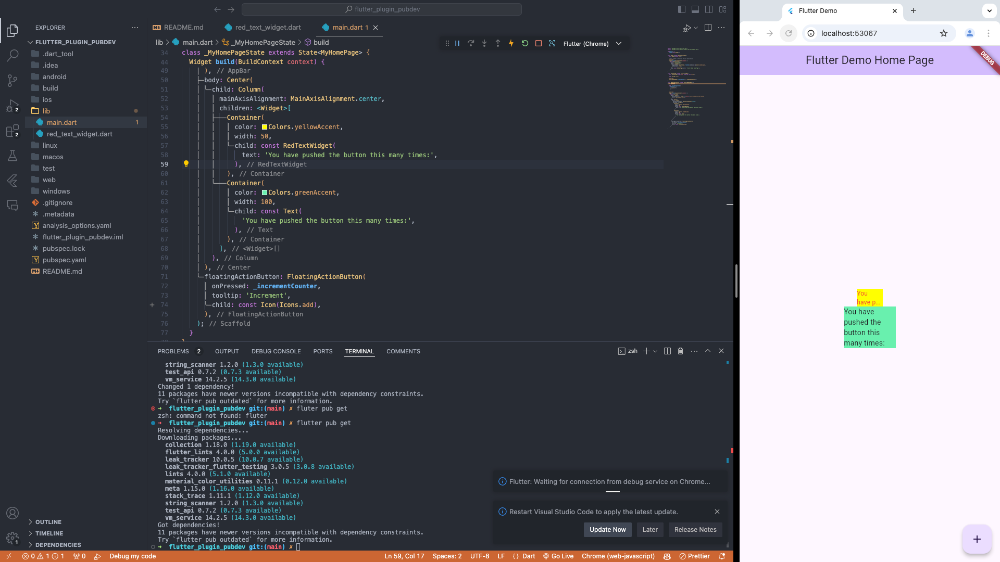

# Tugas Praktikum
### Jelaskan maksud dari langkah 2 pada praktikum tersebut!

     

Plugin auto_size_text di Flutter digunakan untuk membuat teks secara otomatis menyesuaikan ukurannya agar muat dalam batas ruang yang tersedia. Jika teks terlalu panjang untuk ruang yang diberikan, plugin ini akan mengurangi ukuran font secara dinamis sehingga teks tetap dapat ditampilkan tanpa dipotong. Plugin ini berguna untuk menjaga tampilan yang responsif di berbagai ukuran layar.

### Jelaskan maksud dari langkah 5 pada praktikum tersebut!

     

Sintaks Flutter di atas mendefinisikan sebuah konstruktor const untuk widget bernama RedTextWidget, yang menerima parameter text bertipe String dan menandainya sebagai required (wajib diisi). Berikut penjelasan singkatnya:

- final String text;: Mendeklarasikan variabel text yang tidak dapat diubah (final) setelah diinisialisasi, dengan tipe data String.
- RedTextWidget({Key? key, required this.text}): Konstruktor dengan parameter opsional (key) dan satu parameter wajib (text) yang diinisialisasi menggunakan this.text.
- : super(key: key);: Memanggil konstruktor super dari kelas induk (Widget), untuk meneruskan nilai key ke widget dasar.

Ini adalah pola umum dalam pembuatan widget kustom di Flutter.

### Pada langkah 6 terdapat dua widget yang ditambahkan, jelaskan fungsi dan perbedaannya!

     

Ada dua Container dengan teks di dalamnya:

- Container pertama berwarna kuning dengan lebar yang lebih sempit (50 piksel). Teks di dalam Container ini ditampilkan menggunakan widget khusus yang mungkin membuat teks terlihat merah atau punya gaya tambahan.

- Container kedua berwarna hijau dengan lebar yang lebih lebar (100 piksel). Teks di dalam Container ini ditampilkan dengan gaya standar bawaan Flutter tanpa tambahan efek khusus.

Jadi, perbedaannya adalah pada lebar Container, warna latar belakang, dan apakah teks ditampilkan dengan gaya khusus atau tidak.

### Jelaskan maksud dari tiap parameter yang ada di dalam plugin auto_size_text berdasarkan tautan pada dokumentasi ini !

- key: Parameter ini merupakan unique identifier untuk widget. Biasanya digunakan untuk menjaga identitas widget saat terjadi perubahan atau saat widget dipindahkan dalam tree UI.

- textKey: Mirip dengan key, tetapi khusus untuk kunci widget teks. Ini dapat digunakan untuk mengidentifikasi teks dalam widget secara unik jika diperlukan.

- style: Parameter ini menentukan gaya teks seperti warna, ukuran, font, dll. Sama seperti di Text widget, style menggunakan class TextStyle.

- minFontSize: Ukuran font minimum yang diizinkan untuk teks. Jika teks terlalu panjang untuk memenuhi area yang tersedia, maka ukuran font akan mengecil hingga mencapai batas minimum ini.

- maxFontSize: Ukuran font maksimum yang diizinkan untuk teks. Ini adalah batas atas ukuran font, yang berguna untuk menjaga agar teks tidak terlalu besar meskipun ada ruang lebih.

- stepGranularity: Mengontrol besar langkah perubahan ukuran font saat teks menyesuaikan ukurannya. Semakin kecil nilai ini, semakin halus perubahan ukuran font.

- presetFontSizes: Daftar ukuran font yang telah ditentukan sebelumnya. Teks akan menyesuaikan ukurannya dengan menggunakan ukuran-ukuran dari daftar ini, mulai dari yang terbesar hingga terkecil.

- group: Parameter ini memungkinkan widget AutoSizeText untuk berbagi ukuran font yang sama dengan widget lain dalam satu grup. Ini berguna saat Anda ingin beberapa teks di dalam aplikasi memiliki ukuran yang konsisten satu sama lain.

- textAlign: Menentukan perataan teks di dalam widget, seperti TextAlign.left, TextAlign.right, TextAlign.center, dan sebagainya.

- textDirection: Menentukan arah teks seperti kiri ke kanan (TextDirection.ltr) atau kanan ke kiri (TextDirection.rtl), yang penting untuk bahasa-bahasa tertentu.

- locale: Menentukan locale untuk teks, yang digunakan untuk menyesuaikan bahasa, bentuk angka, dan lainnya.

- softWrap: Parameter ini menentukan apakah teks harus membungkus (wrap) ketika mencapai batas layar atau widget, atau jika teks harus terus dalam satu baris panjang tanpa membungkus.

- wrapWords: Jika true, teks akan membungkus pada kata yang terdekat daripada memotong kata di tengah saat membungkus teks.

- overflow: Mengatur bagaimana teks ditampilkan jika melebihi ruang yang tersedia. Beberapa opsi termasuk TextOverflow.clip, TextOverflow.fade, dan TextOverflow.ellipsis (yang akan menambahkan "..." di akhir teks yang terpotong).

- overflowReplacement: Jika teks meluap dan tidak bisa ditampilkan, widget ini akan menampilkan pengganti alih-alih teks yang dipotong. Ini bisa berguna untuk menampilkan sesuatu yang berbeda jika teks terlalu panjang untuk ditampilkan.

- textScaleFactor: Mengatur faktor skala teks, yang menentukan seberapa besar teks ditampilkan relatif terhadap ukuran font yang ditentukan.

- maxLines: Menentukan jumlah maksimum baris yang bisa digunakan oleh teks. Jika teks melebihi jumlah baris yang diizinkan, teks akan dipotong sesuai pengaturan overflow.

- semanticsLabel: Label deskriptif yang dapat dibaca oleh alat bantu seperti screen readers, sehingga pengguna dengan gangguan penglihatan dapat memahami konten teks.