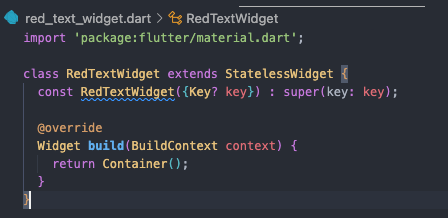
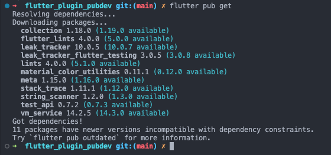
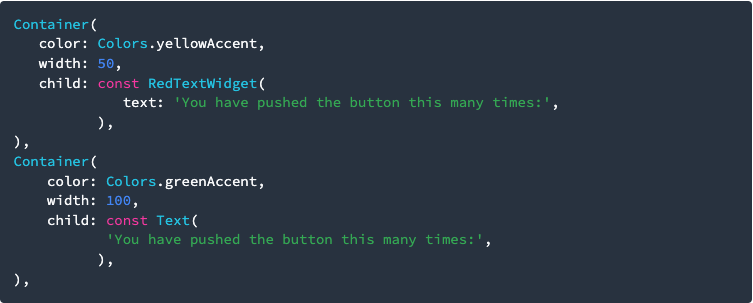
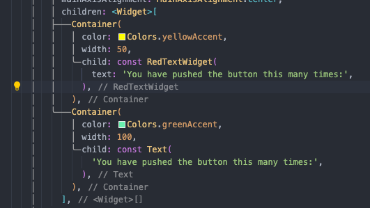

# Pemrograman Mobile - Pertemuan 7

<table>
    <thead>
        <th style="text-align: center;" colspan="2">Pertemuan 7</th>
    </thead>
    <tbody>
        <tr>
            <td>Nama</td>
            <td>Abid Gymnastiar Alfiansyah</td>
        </tr>
        <tr>
            <td>Nim</td>
            <td>2241720043</td>
        </tr>
        <tr>
            <td>Kelas</td>
            <td>3G</td>
        </tr>
    </tbody>
</table>

# Praktikum Menerapkan Plugin di Project Flutter

# Langkah 1: Buat Project Baru

    Buatlah sebuah project flutter baru dengan nama flutter_plugin_pubdev. Lalu jadikan repository di GitHub Anda dengan nama flutter_plugin_pubdev.

- hasil 

     

# Langkah 2: Menambahkan Plugin

    Tambahkan plugin auto_size_text menggunakan perintah berikut di terminal

     

- hasil 

     

    Jika berhasil, maka akan tampil nama plugin beserta versinya di file pubspec.yaml pada bagian dependencies.
- hasil 

     

# Langkah 3: Buat file red_text_widget.dart

    Buat file baru bernama red_text_widget.dart di dalam folder lib lalu isi kode seperti berikut.

     

- Hasil 

     

# Langkah 4: Tambah Widget AutoSizeText

    Masih di file red_text_widget.dart, untuk menggunakan plugin auto_size_text, ubahlah kode return Container() menjadi seperti berikut.

     

- Hasil 

     

    Setelah Anda menambahkan kode di atas, Anda akan mendapatkan info error. Mengapa demikian? Jelaskan dalam laporan praktikum Anda!

- Hasil error

     

- Eror dikarenakan belum menambahkan dependency, jalankan perintah flutter pub get di terminal untuk mendownload package tersebut.

     

- Import package di file Dart: Setelah package terinstall, jangan lupa untuk mengimport auto_size_text di file Dart Anda.

     

# Langkah 5: Buat Variabel text dan parameter di constructor

    Tambahkan variabel text dan parameter di constructor seperti berikut.

     

- Hasil

     

# Langkah 6: Tambahkan widget di main.dart

    Buka file main.dart lalu tambahkan di dalam children: pada class _MyHomePageState

     

- Sintak

     

- Hasil Run

     

